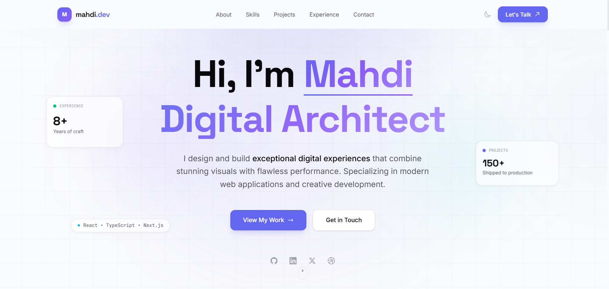

<div align="center">

# ✨ Mahdi Karimi Portfolio

### A Premium Awwwards-Inspired Portfolio Built with Modern Web Technologies


<br/>


**Inspired by Apple • Stripe • Linear • Vercel**

[✨ Features](#-features) •
[🛠 Tech Stack](#-tech-stack) •
[📦 Getting Started](#-getting-started) •
[📁 Project Structure](#-project-structure) •
[⚡ Performance](#-performance) •
[📬 Contact](#-contact)

</div>

---

## 🚀 Overview

A modern, high-performance portfolio website crafted to showcase creative development work through elegant animations, immersive interactions, and pixel-perfect responsive design.

Built with **React 19**, **TypeScript**, **Tailwind CSS v4**, and **Framer Motion**, this project follows modern frontend architecture while prioritizing accessibility, SEO, maintainability, and exceptional user experience.

---

# ✨ Features

### 🎨 Premium UI

- Glassmorphism interface
- Dynamic gradients
- Soft shadows
- Micro interactions
- Smooth animations

### ⚡ Performance

- Optimized bundle
- Lazy loading
- Code splitting
- Core Web Vitals optimized

### 🌙 Theme

- Dark / Light mode
- System preference detection
- Persistent theme storage

### 📱 Responsive

- Mobile First
- Tablet optimized
- Desktop optimized
- 4K ready

### ♿ Accessibility

- Semantic HTML
- Keyboard navigation
- ARIA labels
- WCAG friendly

### 🔍 SEO

- Meta Tags
- Open Graph
- Structured Data
- Sitemap Ready

---

# 🛠 Tech Stack

| Category | Technologies |
|----------|--------------|
| Framework | React 19 |
| Language | TypeScript 5.9 |
| Styling | Tailwind CSS 4 |
| Animation | Framer Motion |
| Build Tool | Vite 7 |
| Linting | ESLint |
| Formatting | Prettier |

---

# 📦 Getting Started

## Clone

```bash
git clone https://github.com/mahdi8p2gi/portfolio.git

cd portfolio
```

## Install

```bash
npm install
```

## Development

```bash
npm run dev
```

## Production

```bash
npm run build

npm run preview
```

---

# 📁 Project Structure

```text
src
├── assets
├── components
│   ├── effects
│   ├── layout
│   ├── sections
│   └── ui
├── hooks
├── utils
├── App.tsx
├── main.tsx
└── index.css
```

---

# 🎨 Design System

### Typography

- Space Grotesk
- Inter
- JetBrains Mono

### Color Palette

| Token | Value |
|-------|--------|
| Primary | #6366F1 |
| Secondary | #8B5CF6 |
| Background | #09090B |
| Surface | #1C1C22 |
| Text | #FAFAFA |

---

# ⚡ Performance

| Metric | Score |
|--------|-------|
| Bundle Size | ~138 KB |
| Build Time | ~2.2s |
| First Contentful Paint | <1s |
| Time To Interactive | <2s |

---

# 📸 Preview

<p align="center">

</p>

---

# 🤝 Contributing

Contributions are always welcome.

```bash
git checkout -b feature/AmazingFeature

git commit -m "Add AmazingFeature"

git push origin feature/AmazingFeature
```

Then open a Pull Request.

---

# 📬 Contact

**Mahdi Karimi**

Creative Frontend Developer

📧 **themahdikga@gmail.com**

🐙 **https://github.com/mahdi8p2gi**

---

# 📄 License

This project is licensed under the **MIT License**.

---

<div align="center">

Built with ❤️ using **React**, **TypeScript**, **Tailwind CSS** & **Framer Motion**

© 2026 Mahdi Karimi

</div>